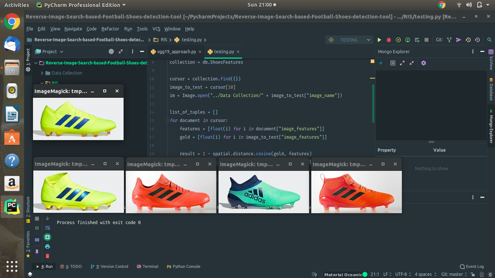

# Reverse-Image-Search-based-Football-Shoes-detection-tool
# Module-1 (Data Collection)
In this module, I created a database containing images of football shoes. To achieve this, I scraped data from https://www.footballbootsdb.com/boot/.

Firstly, I used selenium to get the urls of upto 120 football shoe images. Then I used urllib library to download these images.
# Module-2 (Feature Extraction)
Main idea behind this method for reverse image search is to define images in terms of features and then calculate the cosine distance between images to find the similar images.

I extract features using a pre-trained VGG-19 network with keras. We get the features from the third last layer called flatten. Idea was that this layer is capturing some low level features like edges and shapes e.t.c.

After extracting features, I create a database using MongoDB to store all the data.

# Testing
After saving the features in the db, I tested this approach by giving it one image and then extracting the 4 most similar images. The following image shows the results. First image at the top is the query image and then the results are arranged from left to right in terms of similariy score with left one being the highest.

